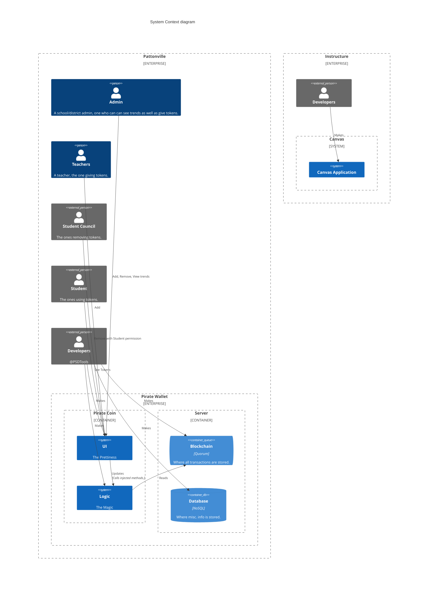

# Pirate Code 3.0

[![Netlify Status][deploys_badge]][deploys_link]
[![Dart][ci_dart_badge]][ci_dart_link]
[![coverage][coverage_badge]][ci_dart_link]
[![Python][ci_python_badge]][ci_python_link]
[![CodeQL][ci_sec_badge]][ci_sec_link]
[![spelling][ci_spell_badge]][ci_spell_link]
[![style: very good analysis][very_good_analysis_badge]][very_good_analysis_link]

Generated by the [Very Good CLI][very_good_cli_link] 🤖

A Very Good Project created by Very Good CLI.

---

A new Flutter project.

## Getting Started 🚀

This project is a starting point for a Flutter application.

A few resources to get you started if this is your first Flutter project:

- [Lab: Write your first Flutter app][flutter_codelab]
- [Cookbook: Useful Flutter samples][flutter_samples]

For help getting started with Flutter development, view the
[online documentation][flutter_docs], which offers tutorials,
samples, guidance on mobile development, and a full API reference.

### Flavors

This project contains 3 flavors:

- development
- staging
- production

To run the desired flavor either use the launch configuration in VSCode/Android Studio or use the following commands:

```sh
# Development
$ flutter run --flavor development --target lib/main_development.dart

# Staging
$ flutter run --flavor staging --target lib/main_staging.dart

# Production
$ flutter run --flavor production --target lib/main_production.dart
```

_\*Pirate Code works on iOS, Android, Web, and Windows._

---

## Running Tests 🧪

To run all unit and widget tests use the following command:

```sh
flutter test --coverage --test-randomize-ordering-seed random
```

To view the generated coverage report you can use [lcov][lcov].

```sh
# Generate Coverage Report
$ genhtml coverage/lcov.info -o coverage/

# Open Coverage Report
$ open coverage/index.html
```

---

## Working with Translations 🌐

This project relies on [flutter_localizations][flutter_localizations_link] and follows the [official internationalization guide for Flutter][internationalization_link].

### Adding Strings

1. To add a new localizable string, open the `app_en.arb` file at `lib/l10n/arb/app_en.arb`.

```json
{
  "@@locale": "en",
  "counterAppBarTitle": "Counter",
  "@counterAppBarTitle": {
    "description": "Text shown in the AppBar of the Counter Page"
  }
}
```

1. Then add a new key/value and description

```json
{
  "@@locale": "en",
  "counterAppBarTitle": "Counter",
  "@counterAppBarTitle": {
    "description": "Text shown in the AppBar of the Counter Page"
  },
  "helloWorld": "Hello World",
  "@helloWorld": {
    "description": "Hello World Text"
  }
}
```

1. Use the new string

```dart
import 'package:pirate_code/l10n/l10n.dart';

@override
Widget build(BUildContext context) {
  final l10n = context.l10n;
  return Text(l10n.helloWorld);
}
```

### Adding Supported Locales

Update the `CFBundleLocalizations` array in the `Info.plist` at `ios/Runner/Info.plist` to include the new locale.

```xml
    ...

   <key>CFBundleLocalizations</key>
   <array>
    <string>en</string>
    <string>es</string>
   </array>

    ...
```

### Adding Translations

1. For each supported locale, add a new ARB file in `lib/l10n/arb`.

```console
├── l10n
│   ├── arb
│   │   ├── app_en.arb
│   │   └── app_es.arb
```

1. Add the translated strings to each `.arb` file:

`app_en.arb`

```json
{
  "@@locale": "en",
  "counterAppBarTitle": "Counter",
  "@counterAppBarTitle": {
    "description": "Text shown in the AppBar of the Counter Page"
  }
}
```

`app_es.arb`

```json
{
  "@@locale": "es",
  "counterAppBarTitle": "Contador",
  "@counterAppBarTitle": {
    "description": "Texto mostrado en la AppBar de la página del contador"
  }
}
```

## C4 Diagram



[ci_dart_badge]: https://github.com/PSDTools/app/actions/workflows/dart.yaml/badge.svg?branch=main
[ci_dart_link]: https://github.com/PSDTools/app/actions/workflows/dart.yaml
[ci_python_badge]: https://github.com/PSDTools/app/actions/workflows/python.yaml/badge.svg?branch=main
[ci_python_link]: https://github.com/PSDTools/app/actions/workflows/python.yaml
[ci_sec_badge]: https://github.com/PSDTools/app/actions/workflows/codeql.yaml/badge.svg?branch=main
[ci_sec_link]: https://github.com/PSDTools/app/actions/workflows/codeql.yaml
[ci_spell_badge]: https://github.com/PSDTools/app/actions/workflows/markdown.yaml/badge.svg?branch=main
[ci_spell_link]: https://github.com/PSDTools/app/actions/workflows/markdown.yaml
[coverage_badge]: https://img.shields.io/badge/dart%20coverage-11%25-CB2431.svg
[deploys_badge]: https://api.netlify.com/api/v1/badges/25b0c44e-21b7-423c-a914-32aa4b23b708/deploy-status
[deploys_link]: https://app.netlify.com/sites/pattonville-wallet/deploys
[flutter_codelab]: https://docs.flutter.dev/get-started/codelab
[flutter_docs]: https://docs.flutter.dev/
[flutter_localizations_link]: https://api.flutter.dev/flutter/flutter_localizations/flutter_localizations-library.html
[flutter_samples]: https://docs.flutter.dev/cookbook
[internationalization_link]: https://flutter.dev/docs/development/accessibility-and-localization/internationalization
[lcov]: https://github.com/linux-test-project/lcov
[very_good_analysis_badge]: https://img.shields.io/badge/style-very_good_analysis-B22C89.svg
[very_good_analysis_link]: https://pub.dev/packages/very_good_analysis
[very_good_cli_link]: https://github.com/VeryGoodOpenSource/very_good_cli
