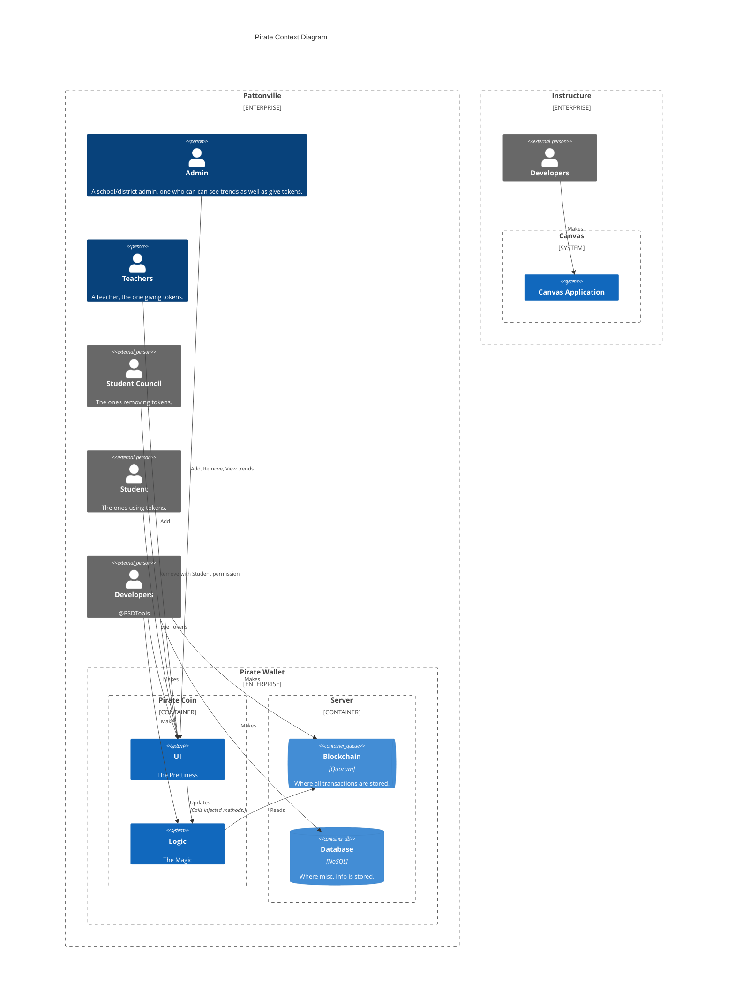

# C4 Diagram

A diagram of our systems, using [Mermaid.js][mermaid]/[PlantUML][plantuml].

```mermaid
C4Context
  title Pirate Context Diagram

  Enterprise_Boundary(pattonville, "Pattonville") {
    Person(admin, "Admin", "A school/district admin, one who can can see trends as well as give tokens.")
    Person(teachers, "Teachers", "A teacher, the one giving tokens.")
    Person_Ext(council, "Student Council", "The ones removing tokens.")
    Person_Ext(students, "Student", "The ones using tokens.")

    Enterprise_Boundary(wallet, "Pirate Wallet") {
      Container_Boundary(Coin, "Pirate Coin") {
        System(Ui, "UI", "The Prettiness")
        System(Logic, "Logic", "The Magic")
      }

      Container_Boundary(server, "Server") {
        ContainerQueue(Block, "Blockchain", "Quorum", "Where all transactions are stored.")
        ContainerDb(Database, "Database", "NoSQL", "Where misc. info is stored.")
      }

    }

    Person_Ext(developers, "Developers", "@PSDTools")

  }


  Enterprise_Boundary(Instructure, "Instructure") {
    Person_Ext(InstructureDevelopers, "Developers")

    System_Boundary(b5, "Canvas") {
      System(CanvasApp, "Canvas Application")
    }

  }

  Rel(admin, Ui, "Uses")
  Rel(InstructureDevelopers, CanvasApp, "Makes")
  Rel(Logic, Block, "Reads")
  Rel(admin, Ui, "Add, Remove, View trends")
  Rel(teachers, Ui, "Add")
  Rel(council, Ui, "Remove with Student permission")
  Rel(students, Ui, "See Tokens")
  Rel(developers, Ui, "Makes")
  Rel(developers, Database, "Makes")
  Rel(developers, Block, "Makes")
  Rel(developers, Logic, "Makes")
  Rel(Ui, Logic, "Updates", "Calls injected methods.")
```

[mermaid]: https://mermaid.js.org/
[plantuml]: https://plantuml.com/
