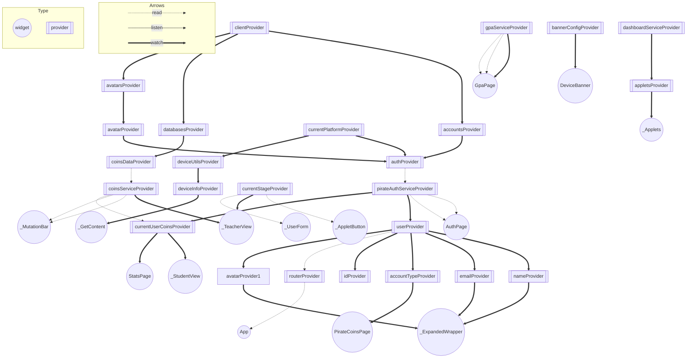

# Riverpod Graph

## Graph



## How to Regenerate

1. From the root of this repo, move out of this repo: `cd ..`.
1. Clone the riverpod repo, and enter it: `git clone https://github.com/rrousselGit/riverpod.git && cd riverpod`.
1. Enter the `riverpod_graph` directory, and activate it: `cd packages/riverpod_graph && dart pub global activate -s path .`.
1. Enter the app directory again, and run `riverpod_graph`: `cd ./../../../app/ && riverpod_graph .`.
1. Copy and paste the output into here.
1. Remove all references to `avatarsProvider` and `avatarProvider`, and then append this to the end:

   ````md
   ```mermaid
    userProvider -.-> routerProvider;
    authProvider -.-> pirateAuthServiceProvider;
    avatarProvider1 ==> _ExpandedWrapper;
    userProvider ==> avatarProvider1;
    avatarsProvider ==> avatarProvider;
    clientProvider ==> avatarsProvider;
    avatarProvider ==> authProvider;
    coinsDataProvider -.-> coinsServiceProvider;
   ```
   ````
